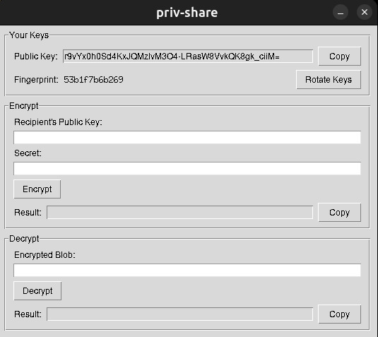

# priv-share

Dead-simple secret sharing using asymmetric encryption. Share API keys, passwords, and secrets over WhatsApp, Telegram, email — whatever. No accounts, no servers, no bullshit.

Each person generates a keypair. Share your public key openly. Anyone can encrypt a secret for you, but only you can decrypt it.

## How it works

```
Alice                                    Bob
  |                                       |
  |  1. shares public key (44 chars)      |
  |  <──────────────────────────────────  |
  |                                       |
  |  2. encrypts secret with Bob's key    |
  |  ──────────────────────────────────>  |
  |     (safe to send over WhatsApp)      |
  |                                       |
  |                          3. decrypts  |
  |                          with private |
  |                          key          |
```

Crypto: Curve25519 + XSalsa20-Poly1305 via [libsodium](https://doc.libsodium.org/) (PyNaCl's `SealedBox`).

## Install

```bash
pip install pynacl
```

## Desktop UI

Don't like terminals? Run the GUI:

```bash
python share-ui.py
```



Same keys, same crypto — fully interoperable with the CLI.

## CLI Usage

### Generate your keypair (one-time)

```bash
python share.py keygen
```

```
Keys saved to /home/you/.privshare/

Your public key (share this freely):
  Bt8blu3h3Bb3gnR1Y3DC2lSr81vCl0aGPiwhbD6IsWo=
```

Put that public key in your WhatsApp bio, pin it in a group chat, whatever.

### Encrypt a secret for someone

```bash
python share.py encrypt "THEIR_PUBLIC_KEY" "sk-live-my-api-key-123"
```

```
Encrypted (send this to them):
  6_3cdyTpi_M2OJGMzQNUWCU0NwglVlHXtFRrz2xIDAhY1ezlP5J2Ny...
```

Or pipe via stdin:

```bash
echo "my-secret" | python share.py encrypt "THEIR_PUBLIC_KEY"
```

Or omit the secret — it'll prompt without echoing:

```bash
python share.py encrypt "THEIR_PUBLIC_KEY"
Secret (won't echo):
```

### Decrypt a secret sent to you

```bash
python share.py decrypt "ENCRYPTED_BLOB"
```

```
Decrypted secret:
  sk-live-my-api-key-123
```

Use `--raw` to get just the value (for scripting):

```bash
python share.py decrypt --raw "ENCRYPTED_BLOB"
```

### View your public key

```bash
python share.py pub
```

## Where are my keys?

```
~/.privshare/
├── private.key   # NEVER share this (chmod 600)
└── public.key    # share freely
```

## FAQ

**Can someone decrypt the message if they intercept it?**
No. Only the person with the matching private key can decrypt it.

**Do I need my own keypair to send someone a secret?**
No. You only need their public key. You don't need to run `keygen` to encrypt — only to decrypt.

**What if I lose my private key?**
Anything encrypted for that key is gone. Run `keygen` again to generate a new pair and share your new public key.
